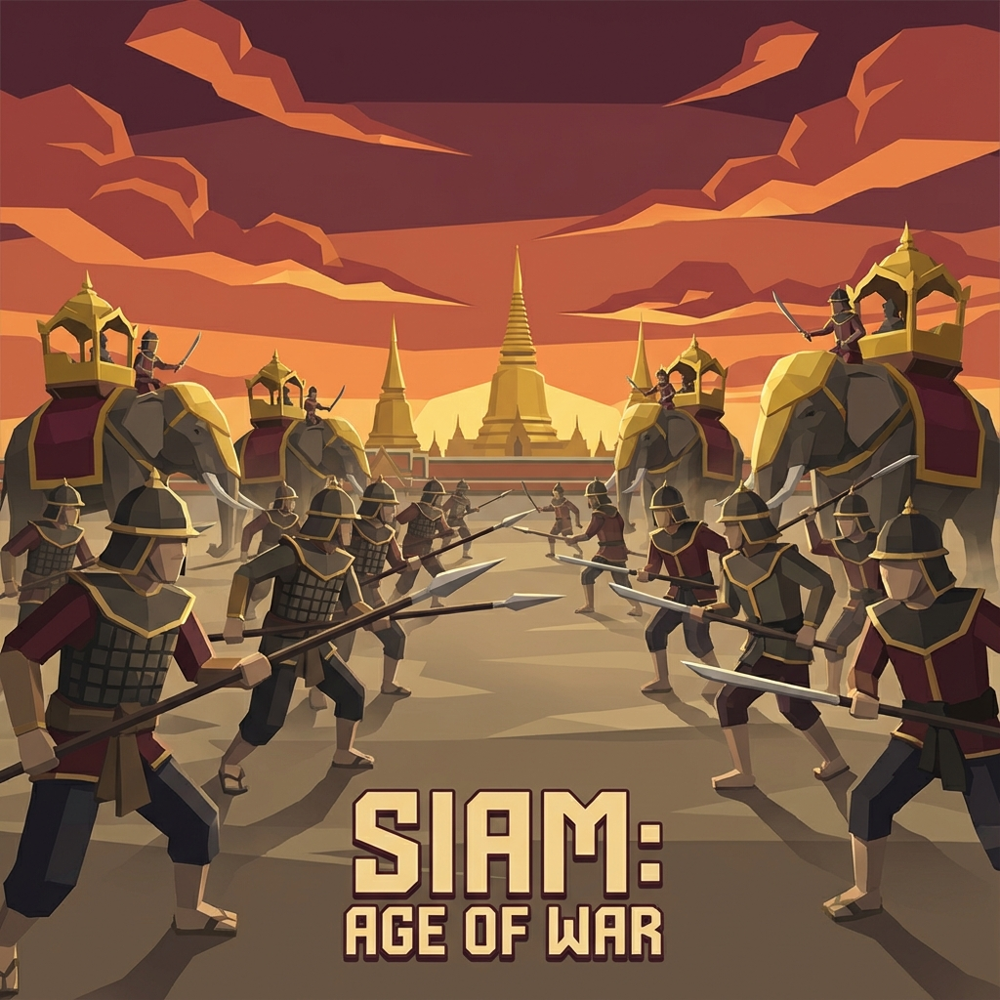

# RTS: ยุทธการไทย - Game Storybook



## 📖 รายละเอียด

เว็บไซต์ Storybook แบบ Interactive สำหรับเกม **RTS: ยุทธการไทย** (Yutthakan Thailand) - เกมกลยุทธ์เรียลไทม์ที่พาผู้เล่นย้อนรอยประวัติศาสตร์การทหารไทย 9 ยุคสมัย ตั้งแต่สงครามช้างเผือก พ.ศ. 2090 ถึงปฏิบัติการอนาคต พ.ศ. 2568

---

## 🚀 วิธีใช้งาน

1. ดับเบิลคลิกที่ไฟล์ `index.html`
2. เว็บไซต์จะเปิดในเบราว์เซอร์โดยอัตโนมัติ
3. ไม่ต้องติดตั้งโปรแกรมหรือ Server ใดๆ เพิ่มเติม

---

## 🎮 การเปิดโปรเจค Unity

### ความต้องการของระบบ

- **Unity Version**: 2022.3 LTS หรือสูงกว่า
- **Unity Hub**: เวอร์ชันล่าสุด
- **Render Pipeline**: Universal Render Pipeline (URP)

### ขั้นตอนการติดตั้ง

1. **เปิด Unity Hub**
   - ดาวน์โหลดและติดตั้ง [Unity Hub](https://unity.com/download) หากยังไม่มี

2. **เพิ่มโปรเจค**
   - คลิก `Add` > `Add project from disk`
   - เลือกโฟลเดอร์ `RTS_Yutthakan_Thailand_Delivery/UnityProject`

3. **เลือกเวอร์ชัน Unity**
   - หากถูกถามให้เลือกเวอร์ชัน ให้เลือก **2022.3 LTS** หรือสูงกว่า
   - Unity จะ import โปรเจคโดยอัตโนมัติ

4. **เปิด Scene หลัก**
   - ไปที่ `Assets/_Scenes/`
   - ดับเบิลคลิก `Prototype_WWI.unity` หรือ Scene ที่ต้องการ

### โครงสร้างโปรเจค Unity

```
UnityProject/
├── Assets/
│   ├── _Scenes/           # Scene files
│   ├── _Scripts/          # C# scripts
│   │   ├── Core/          # Unit, Structure, Formation
│   │   ├── AI/            # AI behaviors
│   │   ├── Input/         # Camera, Selection
│   │   ├── Systems/       # Resources, Tech Tree, Objectives
│   │   ├── UI/            # HUD, Minimap, Menus
│   │   └── Visuals/       # Fog of War, Health Bars
│   ├── Data/              # ScriptableObject assets
│   ├── Prefabs/           # Unit and building prefabs
│   └── Fonts/             # Kanit, Sarabun fonts
├── Packages/              # Package dependencies
└── ProjectSettings/       # Unity settings
```

### การ Build เกม

```bash
# ใน Unity Editor
File > Build Settings > เลือก Platform > Build
```

> ⚠️ **หมายเหตุ**: โฟลเดอร์ `Library/` และ `Temp/` ไม่ได้รวมอยู่ใน Git เนื่องจากเป็นไฟล์ที่ Unity สร้างขึ้นเอง Unity จะสร้างใหม่โดยอัตโนมัติเมื่อเปิดโปรเจค

---

## 📁 โครงสร้างไฟล์

```
RTS ยุทธการไทย/
├── index.html          # หน้าเว็บหลัก
├── styles.css          # สไตล์ชีท (CSS)
├── script.js           # JavaScript สำหรับ Interactivity
├── README.md           # ไฟล์นี้
└── images/             # โฟลเดอร์ภาพประกอบ
    ├── hero.png        # ภาพ Banner หลัก
    ├── campaign1.png   # สงครามช้างเผือก 1547
    ├── campaign2.png   # สงครามท่าดินแดง 1786
    ├── campaign3.png   # วิกฤตการณ์ปากน้ำ 1893
    ├── campaign4.png   # กองกำลังทหารอาสา WWI 1918
    ├── campaign5.png   # กบฏบวรเดช 1933
    ├── campaign6.png   # ยุทธนาวีเกาะช้าง 1940-41
    ├── campaign7.png   # วีรชนอ่าวมะนาว 1941
    ├── campaign8.png   # พยัคฆ์น้อย Korea 1950-53
    ├── campaign9.png   # ปฏิบัติการนาคราช 2025
    ├── units.png       # ภาพ Showcase หน่วยรบ
    └── gameplay.png    # ภาพ Mockup หน้าจอเกม
```

---

## 🎨 ส่วนประกอบของเว็บไซต์

| Section | รายละเอียด |
|---------|-----------|
| **Hero** | Banner เปิดหน้าพร้อมสถิติเกม |
| **ภาพรวม** | Executive Summary และ USPs ของเกม |
| **แคมเปญ** | Gallery 9 แคมเปญประวัติศาสตร์ พร้อมภาพและรายละเอียด |
| **หน่วยรบ** | ตารางหน่วยรบและการแบ่งตามยุคสมัย |
| **ระบบเกม** | Core Loop, ทรัพยากร, การต่อสู้, Visibility, Terrain, AI |
| **คุณสมบัติ** | Museum Mode, Localization, Accessibility, Tech Stack |

---

## 💻 ข้อมูลทางเทคนิค

- **เทคโนโลยี**: HTML5, CSS3, Vanilla JavaScript
- **ฟอนต์**: Google Fonts (Kanit, Sarabun)
- **ดีไซน์**: Thai Military Theme (Gold/Navy), Glassmorphism, Dark Mode
- **Responsive**: PC-first, รองรับ Tablet และ Mobile
- **Animations**: Scroll reveal, Parallax hover effects, Smooth scroll

---

## 📚 เอกสารอ้างอิง

- [Game Design Document (GDD)](RTS_Yutthakan_Thailand_Delivery/Docs/RTS_Yutthakan_Thailand_GDD_v1.0.md)
- [Campaign Design Sheets](RTS_Yutthakan_Thailand_Delivery/Docs/RTS_Campaign_Design_Sheets.md)
- [AI Design Document](RTS_Yutthakan_Thailand_Delivery/Docs/RTS_AI_Design.md)

---

## ⚔️ 9 แคมเปญประวัติศาสตร์

1. **สงครามช้างเผือก (1547-1549)** - สมเด็จพระสุริโยทัย ยุคอยุธยา
2. **สงครามท่าดินแดง (1786)** - รัชกาลที่ 1 สงครามป่า
3. **วิกฤตการณ์ปากน้ำ (1893)** - สงครามทางเรือกับฝรั่งเศส
4. **กองกำลังทหารอาสา (1918)** - สงครามโลกครั้งที่ 1 ฝรั่งเศส
5. **กบฏบวรเดช (1933)** - สงครามกลางเมือง รถไฟหุ้มเกราะ
6. **ยุทธนาวีเกาะช้าง (1940-41)** - สงครามไทย-ฝรั่งเศส
7. **วีรชนอ่าวมะนาว (1941)** - ญี่ปุ่นบุกไทย
8. **พยัคฆ์น้อย (1950-53)** - สงครามเกาหลี
9. **ปฏิบัติการนาคราช (2025)** - อนาคตสมมติ

---

## ©️ ลิขสิทธิ์

**DISCLAIMER:** This game is a historical fiction work based on real events. Liberties have been taken for gameplay balance. It does not intend to promote violence or hatred against any nation.

© 2025 RTS: Yutthakan Thailand - Game Design Document v1.0
